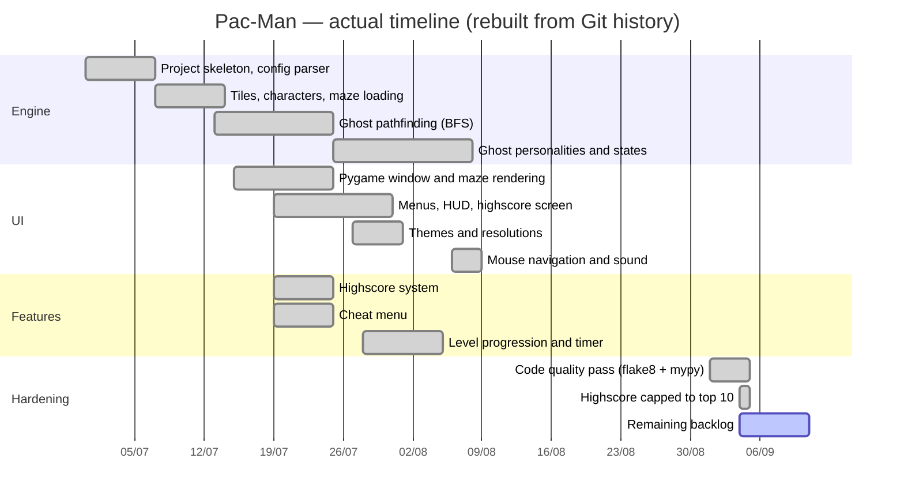

# Timeline and Milestones

## Overview

The project ran for **9 weeks**, from **2026-06-30** (initial commit) to
**2026-09-01** (last feature commit), for a total of **51 commits**.

## Measured activity per week

Commits per ISO week, all authors, from `git log`:

| Week | Commits | Main focus |
|---|---|---|
| S27 (30/06 – 06/07) | 9 | Repository setup, config parser, first engine classes |
| S28 (07/07 – 13/07) | 2 | `characters.py`, `tile.py` |
| S29 (14/07 – 20/07) | 12 | Ghost movement, highscore system, cheat menu |
| S30 (21/07 – 27/07) | 7 | Assets, project architecture, name-entry screen |
| S31 (28/07 – 03/08) | 13 | HUD, levels, timer, colour themes |
| S32 (04/08 – 10/08) | 2 | Mouse menu, launch sound, ghost sprites |
| S33 (11/08 – 17/08) | 4 | Makefile, packaging metadata |
| S36 (01/09 – 07/09) | 2 | Documentation, code-quality pass |

The two-week gap between S33 and S36 corresponds to the summer break.

## Milestones

| # | Milestone | Reached | Evidence (find the commit with) |
|---|---|---|---|
| M1 | `make run` launches and parses the config | 2026-07-03 | `git log --grep "feat(config): make run fonctionne"` |
| M2 | Game logic complete, rendering still to do | 2026-07-16 | `git log --grep "feat(engine): logique de jeu complete"` |
| M2b | Maze rendered with Pygame | 2026-07-24 | `git log --grep "refactor(ui): deplace le code Pygame"` |
| M3 | Ghosts move autonomously | 2026-07-16 | `git log --grep "feat(ghosts): deplacement autonome"` |
| M4 | Highscore system persisted to JSON | 2026-07-19 | `git log --grep "feat(ui): systeme de highscore"` |
| M5 | Cheat menu operational | 2026-07-19 | `git log --grep "feat(ui): menu cheat"` |
| M6 | Name entry after game over | 2026-07-25 | `git log --grep "feat(ui): ecran de saisie du pseudo"` |
| M7 | HUD, levels and level timer | 2026-07-28 | `git log --grep "feat(ui): HUD complet"` |
| M8 | Colour themes | 2026-07-29 | `git log --grep "feat(ui): option de theme"` |
| M9 | `make lint` clean (flake8 + mypy strict) | 2026-09-04 | see [06](06-progress-tracking.md) |
| M10 | Packaging and publication | **not reached** | — |

## How the schedule was built

The work was sequenced by dependency rather than by calendar, in four blocks:

1. **Engine first.** Nothing could be drawn before the maze could be loaded and
   walked, so the config parser, the tile map and the characters came first.
2. **UI once the engine was observable.** Rendering started as soon as there
   was a map and entities to show, which is why the two blocks overlap in the
   Gantt chart from mid-July.
3. **Features on top of a playable base.** Highscores, cheat menu, levels and
   timer were only added once a level could be completed end to end.
4. **Hardening last.** This ordering is the one thing we would change: see
   [06-progress-tracking.md](06-progress-tracking.md).

The plan was agreed verbally at the start and tracked by dependency, not
written down as a dated schedule. The Gantt chart above is therefore a
reconstruction from the Git history, not a plan drawn before the work — which
is itself a finding: without a written baseline there was nothing to notice
the packaging and documentation slippage against.
